# MyFirstRepository
Hello My name is JIWON

## 2주차 과제
</img>

## 3주차 과제
</img>
</img>
</img>

## 4주차 과제

 -카페 정보를 모아 제공해주는 앱
  :위치를 공유하여 주변에 있는 카페의 정보(카페 내부사진, 메뉴 등)를 제공해주는 앱
  요즘 sns상에서 개인카페가 인기가 있다.여러 카페 중 비교하고 싶을 때 
  따로 검색하는 번거로움을 줄이고 한눈에 비교가 가능하다.
   1.위치를 공유하여 지도상의 이미지에 아이콘으로 카페들을 표시
   2.궁금한 카페 클릭
   3.해당 카페의 이미지와 메뉴, 후기 등의 정보를 알 수 있음
   
## 7주차 과제
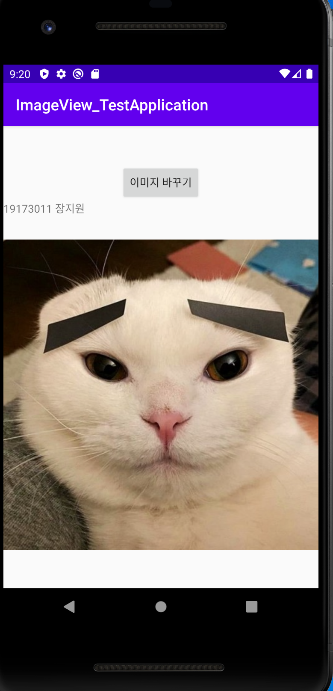</img>
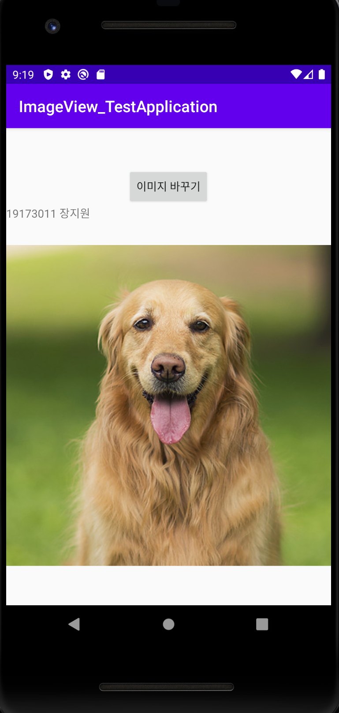</img>

## 9주차 과제
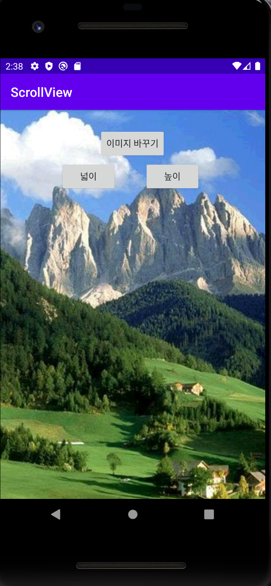</img>
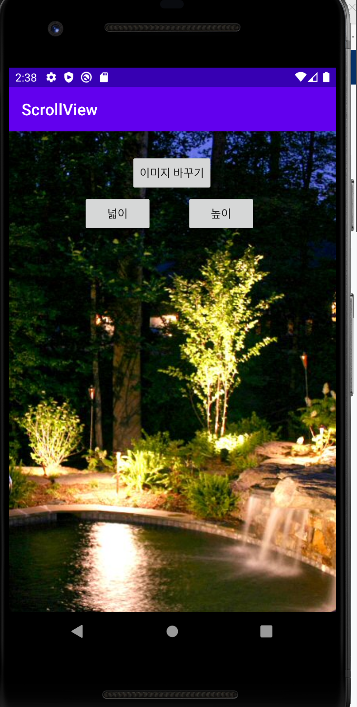</img>
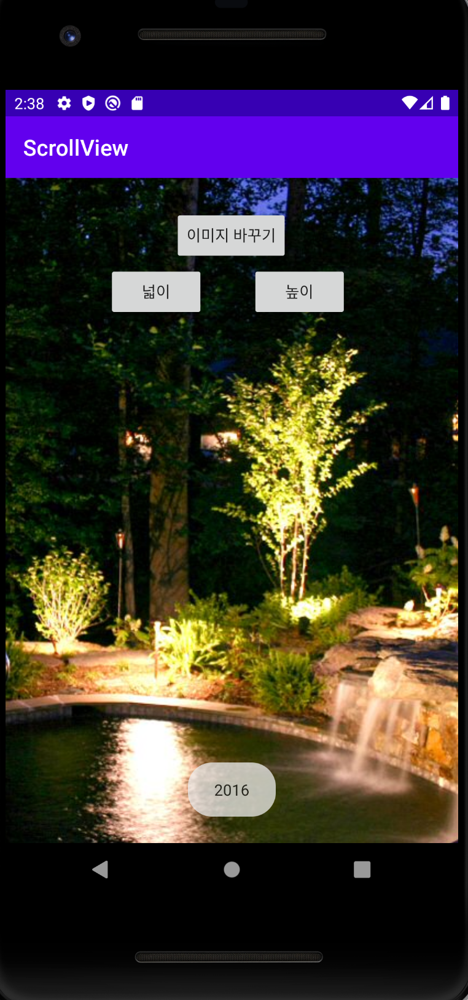</img>
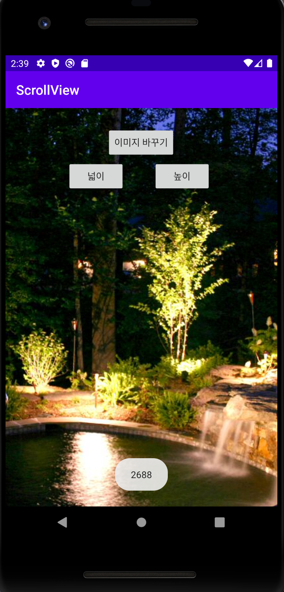</img>

## 10주차 과제
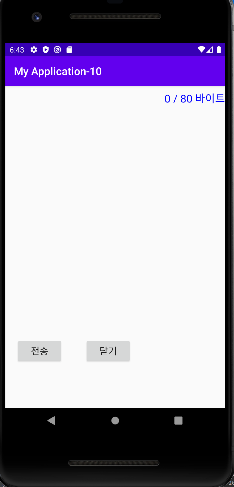</img>
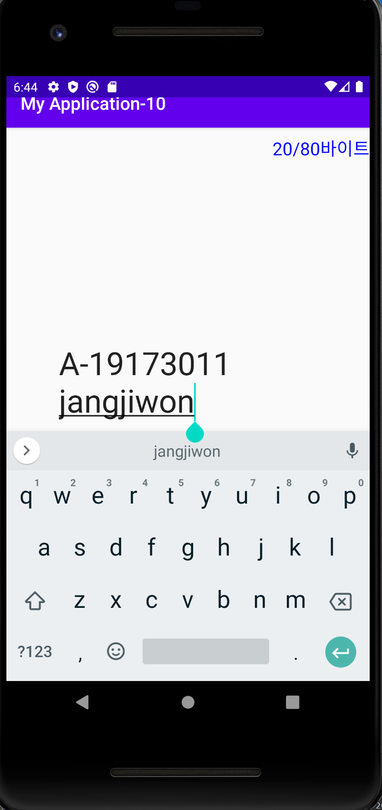</img>

## 11주차 과제
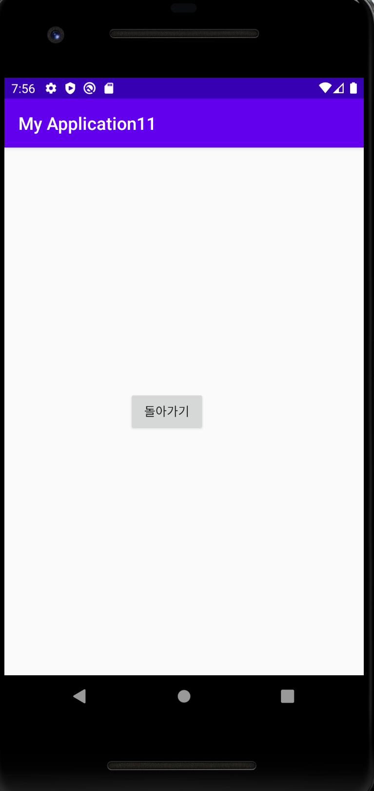</img>
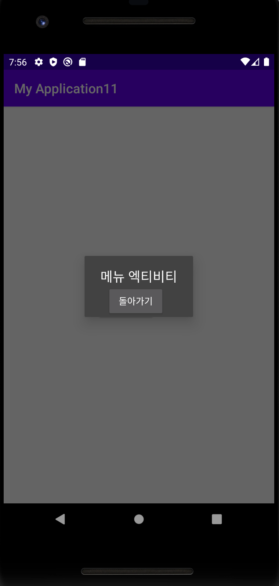</img>
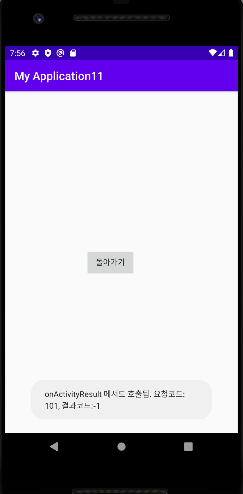</img>
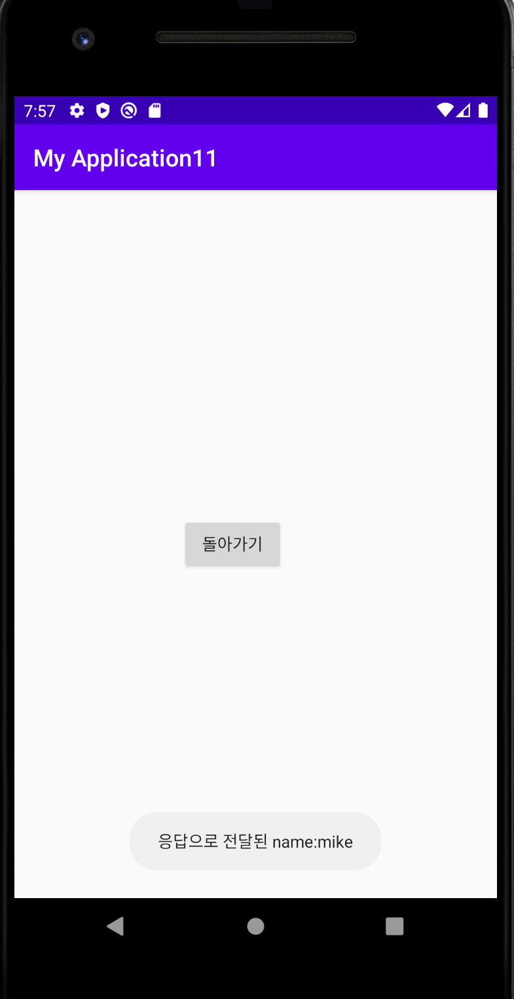</img>

## 12주차 과제
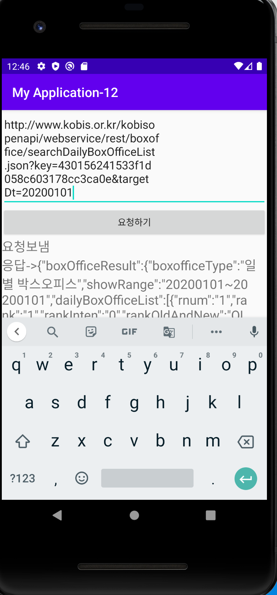</img>

## 기말고사 및 졸업작품
안녕하세요 19173011 장지원 기말고사 및 졸업작품 제출합니다.
일단 저는 13주차에서 더 진도를 나간 14주차 소스에 변형을 주었습니다.
아이콘을 변경시켰고 audiCnt를 salesAmt로 변경시켜
'관객수'가 아닌 '총 판매수량'을 나타내 보았습니다.
하지만 깃허브와 연동시키는 과정에서 오류가 발생하여 
원래 제출하던 방식대로 제출하게 되었습니다.
양해 부탁드립니다.

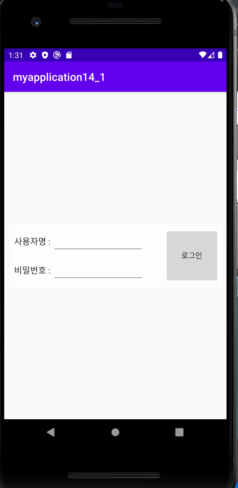</img>
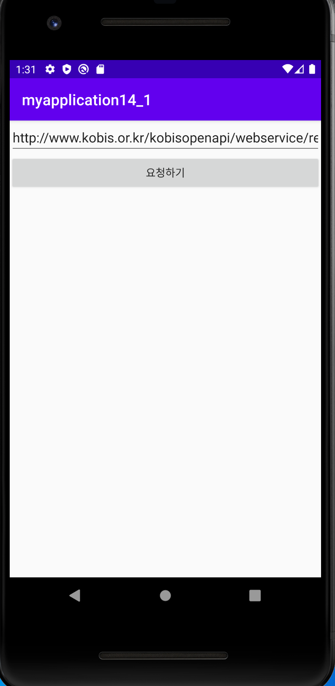</img>
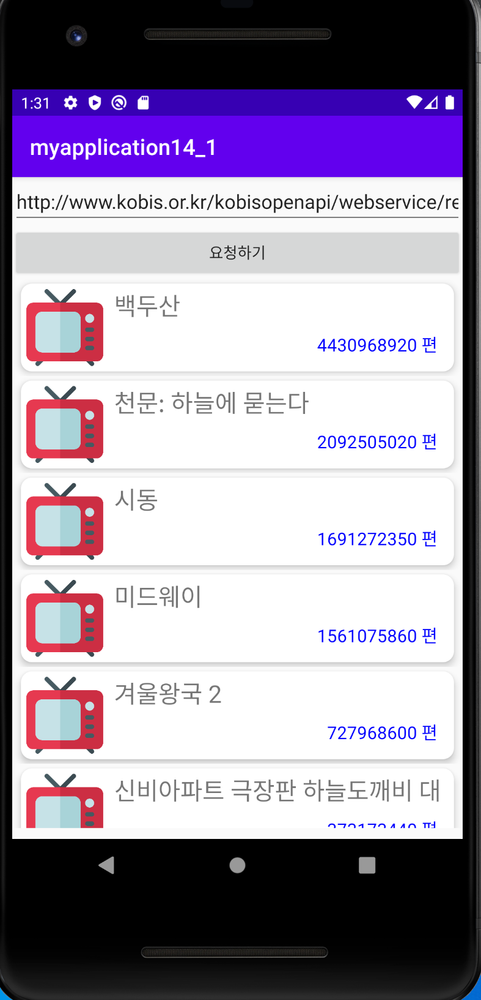</img>
